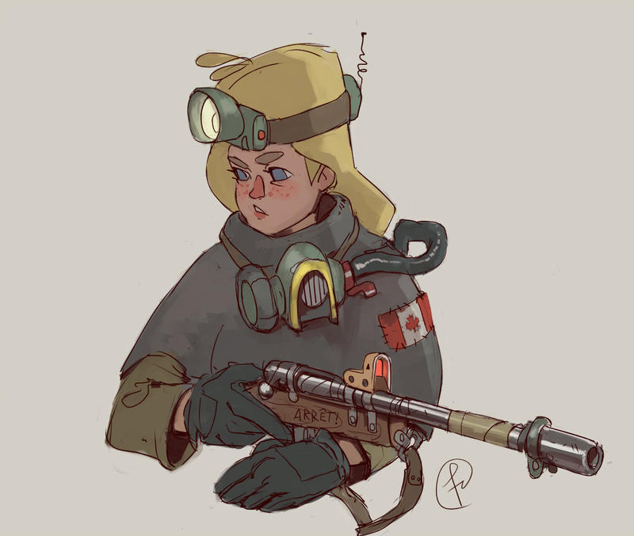
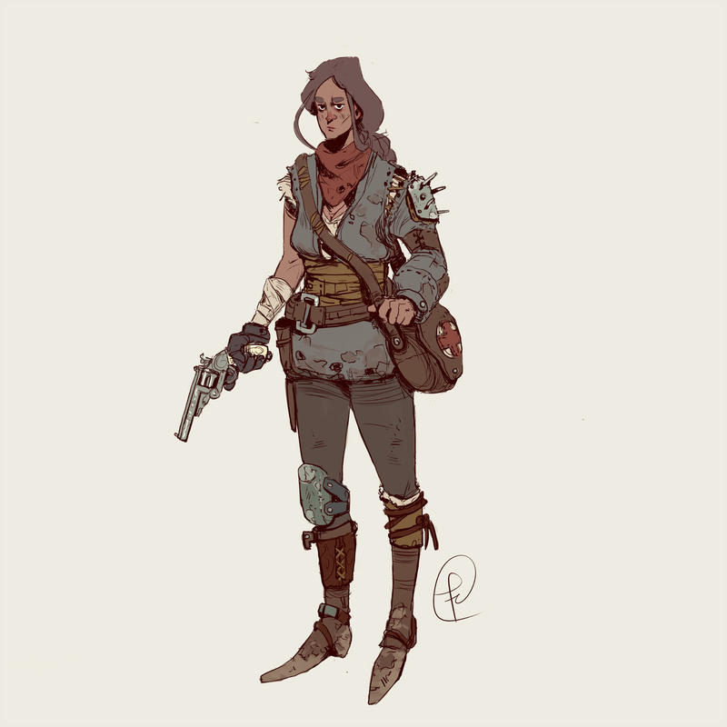
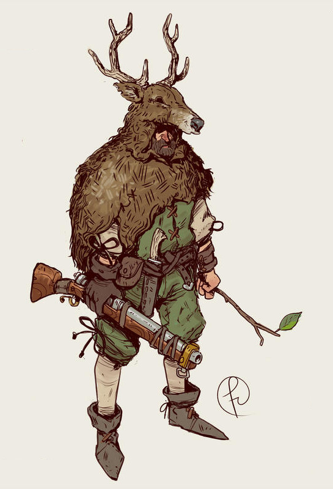
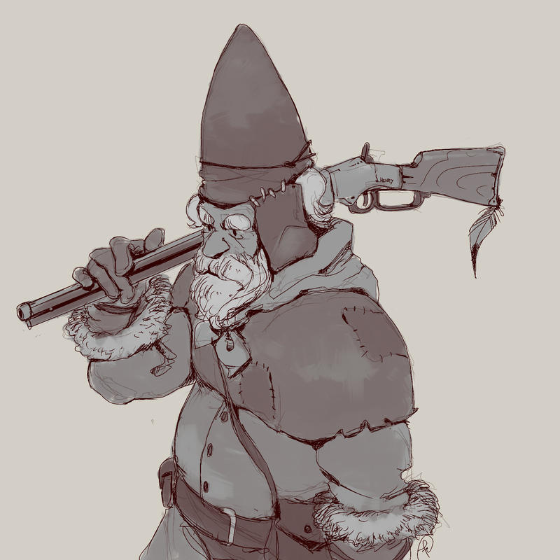
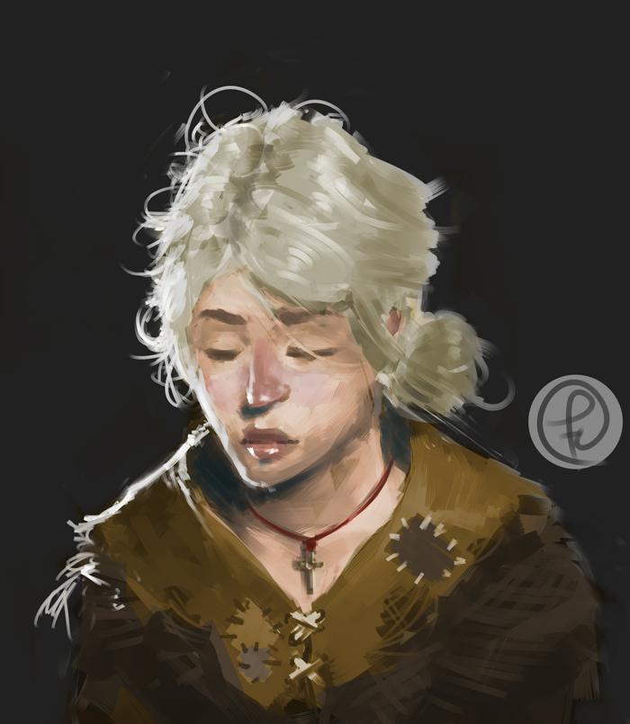
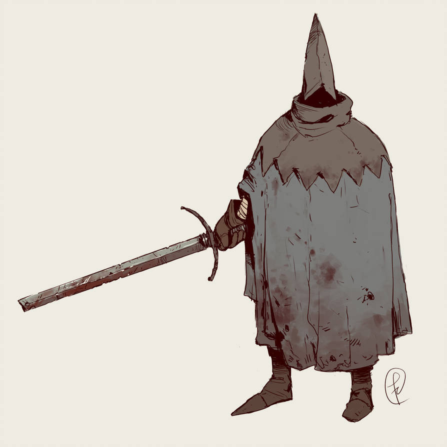

<!--
# RAF: définir MVP prochaine partie
- fiche de PJ imprimable (talents imposés ?)
- règles PNJs finies
- règle scénario finies
- règles de navigation dans les tunnels : PAS découverte des lieux au hasard ? subcarto en connaissent au moins 1 ou 2 de nom ?
- gimmicks/manie : juron ; bricoler / activer reliques ; explorer passages secrets & lieux inaccessibles
  => lorsqu'appliqué, n'importe quel joueur autour de la table peut lancer 1d6 -> si impair +1 jeton bravoure pour le PJ
- mécanique de jeu pour Ombre & Lumières

# RAF: mise en forme
- pronoms à rendre + inclusifs
- indiquer "confidentiel" sur les pages réservées au MJt

## Puzzles

Idées en vrac:
- PJs découvrent 1 à 3 mots magiques (qu'ils inventent _in game_) qui chacun déclenche un effet différent
- portes activables à l'énonciation d'un mot magique
- basé sur contrôle du niveau d'eau
- se jeter dans le vide
- magie qui transforme la pierre en autre chose
- colosse à vaincre dans une salle
- énigme de réflection de la lumière
- pattern/format commun à plusieurs mécanismes : suite de 3 à 6 d6 (diégétique : indique placement de doigts de la main, 6 => paume)
- grille de sudoku sans lignes, avec des points représentant des d6

Tom Hermans advice:
  * A puzzle should be inviting and rewarding
  * Use the smallest amount of space and puzzle pieces for the puzzle will work
  * by teaching new things in every levels, puzzles become much more focused and elegant
  * Puzzles should be a little bit inaccessible if they want to evoke a feeling of mystery and sensation to drive the player
  * + continuity & foreshadowing

Mes contraintes créatives:
  * _environmental_ + se baser sur la faune / flore
  * la majorité des puzzles ne doit pas nécessiter d'item mais une simple connaissance des règles / de l'environnement / de mots magiques
  * faire découvrir aux joueurs des "raccourcis" pour des tâches laborieuses
  * certaines énigmes seront visuelles et incluses dans le jeu

# Playtest n°1 ~4h30
* ++mystères & énigmes (ex: tapis de mousse collante)
* bon nombre Talents
* pulsions trop compliquées & fréquents -> à simplifier
* quelques améliorations de pouvoirs

Illus à deepdreamer: https://pixabay.com/photos/cave-tunnel-underground-entrance-94193/ & plantes-fascinantes-hydnora-africana.jpg

Si satisfait, demander feedback à http://hu-mu.blogspot.com ?

A terme : jeu-écran ?
-->
# Sous terre
Ceci est un jeu de rôle d'aventures et d'exploration avec un meneur et 3 joueurs.
L'histoire progresse semi-aléatoirement,
et l'accent est mis sur des énigmes-puzzles et l'inventivité des PJs pour résoudre les obstacles.

Le jeu est conçu pour des sessions courtes mais également pour être éminément rejouable,
chaque partie permettant aux joueurs de connaître un peu mieux l'Agartha, ses pièges et ses trésors.

Il nécessite 2 dés à 6 faces et quelques pions quelconques,
et seulement 10min de préparation du MJ.

::: toc
<!-- Pour mettre à jour ce sommaire:
    markdown-toc --indent "    " --maxdepth 3 -i sous-terre.md
Certaines URLs génrées sont incompatibles avec celles produites par md2html, ex: puzzles-probl-mes-ouverts
-->

<!-- toc -->

- [Univers](#univers)
- [Déroulement](#deroulement)
- [Scénario](#scenario)
    * [PNJs](#pnjs)
    * [Objectif des PJs](#objectif-des-pjs)
    * [Rebondissement majeur](#rebondissement-majeur)
    * [Fin](#fin)
- [Début de partie](#debut-de-partie)
    * [Le sub-cartographe](#le-sub-cartographe)
    * [L'archéo-magasinier](#larcheo-magasinier)
    * [Le tempo-magus](#le-tempo-magus)
    * [Liste de Talents](#liste-de-talents)
- [Système](#systeme)
- [Exploration](#exploration)
    * [Tunnels](#tunnels)
    * [Lieux étranges](#lieux-etranges)
- [Table narrative](#table-narrative)
- [Puzzles & problèmes ouverts](#puzzles--problemes-ouverts)
    * [Indices](#indices)
- [Trouvailles](#trouvailles)
    * [Reliques](#reliques)
- [Campagne cachée](#campagne-cachee)
    * [Les indices à distiller aux PJs](#les-indices-a-distiller-aux-pjs)
    * [L'explication](#lexplication)
    * [Conseils](#conseils)
- [FAQ](#faq)
    * [Comment gérer la mort et les blessures ?](#comment-gerer-la-mort-et-les-blessures-)
    * [Comment gérer les paradoxes temporels ?](#comment-gerer-les-paradoxes-temporels-)
    * [Licence, sources & inspirations](#licence-sources--inspirations)

<!-- tocstop -->

:::

<!-- Not-CC, inspi seulement: -->

<!-- FROM: http://www.aka-games.fr -->

<!-- ^ ALL ABOVE FROM: https://www.xboxlive.fr/news_affiche_7846.html -->

#### Jeu de rôle ?
Si vous ne connaissez pas encore ce type de jeu, commencez par lire [la définition du JdR de la FFJdR](http://www.ffjdr.org/ce-devez-savoir-jeu-role/definitions-du-jeu-role/)
ou [ce micro-JdR explicatif de Epidiah Ravachol](https://dig1000holes.files.wordpress.com/2013/04/qequjdr.pdf).
Voici quelques abréviations employées par la suite :
<dl>
  <dt>MJ</dt><dd>Meneur de Jeu</dd>
  <dt>PJ</dt><dd>Personnage d'un Joueur</dd>
  <dt>PNJ</dt><dd>Personnage Non Joueur, tous les autres personnages de l'histoire, incarnés par le MJ</dd>
  <dt>1d6</dt><dd>un dé à six faces</dd>
  <dt>1d3</dt><dd class="arrow-list">lancer d'un dé à six faces :<ul>
    <li>sur un <s>⚀</s> ou un <s>⚁</s>, le résultat est <strong>1</strong></li>
    <li>sur un <s>⚂</s> ou un <s>⚃</s>, le résultat est <strong>2</strong></li>
    <li>sur un <s>⚄</s> ou un <s>⚅</s>, le résultat est <strong>3</strong></li>
  </ul></dd>
  <dt>1d2</dt><dd>lancer un dé à six faces → le résultat est <strong>1</strong> si le résultat est impair, <strong>2</strong> sinon</dd>
</dl>

## Le monde connu des PJs

Suite à une catastrophe il y a bientôt un siècle, ce qui reste de l'humanité s'est réfugiée sous terre,
dans un vaste réseau de tunnels.

\+ mention Vril, saison rouge / Pollen & Skavens

\+ on y marchande en faisant du troc ou avec de l'or

Agartha = dangereuse zone "instable", plus profondéùent sous terre, parcourue d'une étrange énergie, le Vril

surface hors de vue -> puits de lumière

## Déroulement
1. En amont, le MJ définit aléatoire un scénario, ainsi que les PNJs potentiels (10min)
2. Durant la partie, les PJs explorent l'Agartha, alternant les phases :
  * de progression dans les tunnels
  * d'exploration de lieux notables, dans des salles souterraines

Chaque jet de dés des PJs active la table narrative du MJ.

#### Règle d'or
::: rule-focus
Lorsque le résultat d'un jet de dé dans une table
ne plait pas au MJ, ne pas hésiter le relancer,
ou à directement choisir un autre résultat !
:::

## Scénario
Le « fil rouge » d'une partie de **Sous terre** est toujours définit aléatoirement,
en combinant :
1. des PNJs pré-générés aléatoirement
2. un objectif principal des PJs
4. un rebondissement majeur
4. une fin

Suivez les instructions des sections correspondantes ci-dessous,
et reportez sur une feuille dédiée les éléments de votre scénario.

### PNJs

 | 
-----------------------------------------------------------------|-
                         | 
                           | 

Chaque PNJ doit représenter pour les joueurs un risque et une opportunité.
Ils peuvent se révéler hostiles immédiatement ou les trahir plus tard,
mais aussi être une aide précieuse.

Énoncez cette règle explicitement à vos joueurs :
::: rule-focus
Si les PJs trouvent le bon levier, chaque PNJ peut devenir un allié.
:::

Durant une partie de **Sous terre**, les PJs vont être amenés à rencontrer entre 1 et 4 PNJs.
Avant la partie, le MJ définit donc 4 PNJs aléatoirement, selon ces règles :

- **Nom** & **Illustration** : lancez 2d6 dans cette table puis choisissez une des images 6 ci-dessus
|       | ~~⚀~~ ~~⚁~~      | ~~⚂~~ ~~⚃~~      | ~~⚄~~ ~~⚅~~      |
|-------|------------------|------------------|------------------|
| ~~⚀~~ |     Johanna      |    Hortense      |    Gina          |
| ~~⚁~~ |     Lisette      |    Mathilde      |    Agnès         |
| ~~⚂~~ |     Eloïse       |    Cora          |    Joachim       |
| ~~⚃~~ |     Douglas      |    Friedrick     |    Anselme       |
| ~~⚄~~ |     Gaël         |    Yann          |    Darius        |
| ~~⚅~~ |     Joachim      |    Abel          |    Ghislain      |

- **Occupation** (fournir bonus aux PJs si PNJ les accompagne): ~~⚀~~trappeuse solitaire, ~~⚁~~cartographe, ~~⚂~~archéologue chercheuse de reliques,
~~⚃~~herboriste ceuilleuse, ~~⚄~~perdue, ~~⚅~~tueuse de Skavens.

- **Objectif** :
::: dice-list
- s'est perdu, souhaite sortir de ce labyrinthe
- trouver une monnaie d'échange auprès des Skavens contre sa fille (tir
- trouver un artefact -> 1d2 : pour l'acquérir / pour le détruire
:::

Afin de rendre vos personnages plus réalistes, astreignez-vous à suivre cette règle :
::: rule-focus
Un PNJ ne révèle jamais spontanément ni explicitement son objectif.
:::

Ce serait se rendre bien trop vulnérable. Non, il couvrira toujours initialement ses véritables intentions.
Qu'il propose un marché aux PJs, qu'il leur révéle des informations, qu'il leur raconte d'effrayantes histoires
ou simplement qu'il les chasse colériquement, ses paroles et actions suffiront à révéler aux PJs attentifs ce qu'il cherche à obtenir.

- **Attitude** initiale :
::: dice-list
- folie -> pair / impair -> douce / dangereuse
- bienveillant
- hostile voir agressif
- 
- les piège pour les voler
- 
:::

- **Atout** :
::: dice-list
- connait les tunnels comme sa poche, sait se rendre dans n'importe quel lieu
- possède une relique (à tirer aléatoirement dans la table correspondante)
- possède une arme très puissante
:::

- **Possessions** : l'arme présente sur l'illustration s'il y en a, plus 2 objets tirés dans cette table :
::: dice-list
- bla
:::

- **Levier** pour les PJs :
::: dice-list
- est blessé et recherche des soins
:::

- **Est terrifié par** :

- **Particularité** :
::: dice-list
- ne peut pas communiquer : quasi-muet, ne s'exprime que par onomatopées primales
- commence à se transformer en Skaven
:::

- **Peut orienter les PJs vers 1 indice** :

- **Connaissance de l'environnement** : 1 _move_ qu'il connait et quel les PJs pourront apprendre en l'observant (ex: gousses de pollen vert pour ralentir chutes)

### Objectif des PJs
La nuit dernière, Damian, leur chef-sorcier, est mort de blessures infligés lors d'une attaque de Skavens.
Avant de rendre son dernier souffle, son dernier commandement fut de vous envoyer dans l'Agartha pour une mission :
::: dice-list
- retrouver Erik, son fils, qui n'est pas encore revenu d'une expédition là-bas, avant de déplacer la communauté
- une relique suffisament puisant pour les aider à repousser les Skavens
- vous infiltrer derrière les lignes ennemis et semer la panique chez les Skavens
- trouver une source de nourriture près de laquelle votre communauté pourrait s'installer
- traquer le Skaven qui l'a mortellement blessé, et récupérer le collier de pouvoir qu'il lui a volé
- placer son corps embaumé dans la crypte de ses ancêtres, sans quoi il risque de revenir d'entre les morts
:::

\+ inclure 1 PNJ systématiquement dans scénario

\+ définir système de progression :
combien de lieux avant d'atteindre objectif ?

### Rebondissement majeur

### Fin
-> chacun cite sa scène / tirade préférée ?

##  Début de partie
En début de partie, les joueurs se répartissent les 3 personnages,
en complétant les questions sur le feuille & en suivant les instructions relatives à leur capacité spéciale,
puis choisissent 4 talents dans la liste ci-dessous.

::: character
### Le sub-cartographe

#### Nom

#### Qui était Damian pour vous ?

#### Autre question personnelle ?

#### Talents

 
 
 
 
 
 

#### Règles spéciales
gère la carte + sait comment réagir aux dangers

+1 Talent : s'orienter
7-9 -> 1 au choix:
10+ -> 2 au choix:
* progression rapide
* rajouter tunnel entre 2 lieux distants de max 2 tunnels
* choix type de tunnel

\+ soigneur ?
:::

::: character
### L'archéo-magasinier

#### Nom

#### Qui était Damian pour vous ?

#### Autre question personnelle ?

#### Talents

 
 
 
 
 
 

#### Règles spéciales
gère inventaire / réparti équipement entre joueurs / comprend reliques

+ 1 Talent : connaissance des reliques
Si étudie indices:
10+ => x2
+1 nature de relique,
+1 effet OU 1 lien

-> à revoir

\+ a un fusil (d'après illus)
\+ 1-2 indices table 66 dès le départ ?
\+ 1 relique de départ ?

Seul à savoir lire & écrire
:::

::: character
### Le tempo-magus

#### Nom

#### Qui était Damian pour vous ?

#### Autre question personnelle ?

#### Talents

 
 
 
 
 
 

#### Règles spéciales
la cordée, précieuse corde tressée héritée de son maître

un mot par pouvoir

1 utilisation (globale) d'un ces pouvoirs par 30min de jeu (heure d'utilisation notée sur feuille PJ), et pas 2x de suite le même
  * déflagration Vril : bourasque électrique capable de projeter plusieurs adversaires en l'air
  * mur de métal : fait sortir 4d6 barres de fer du sol
  * retour en arrière dans le temps avec tous ceux encordés (au moment de l'utilisation)
  cf. FAQ
  en restant sur place -> paradoxe
:::

### Liste de Talents
- observer
- bricoler
- se cacher
- escalader
- combattre
- intimider
- soigner
- pister
- sprinter / parkour
- être fort
- tromper

## Système
:::rule-focus
2d6 +1/Talent +1/Équipement
:::
Lorsqu'un PJ tente de réaliser une action risquée,
le joueur annonce quels Talents et équipements vont l'aider dans cette situation.
Il lance ensuite deux dés à six faces auquel il additionne le nombre de ces compétences & objets.
Le MJ peut refuser certains Talents / équipements s'il considère qu'ils n'aideront pas beaucoup le Pj dans ce contexte.

Le MJ interprête le résultat du jet ainsi, et décrit la scène qui s'ensuit :
* **6 ou moins** : c'est un échec !
* de **7 à 9**, le MJ choisit :
  + **soit** d'interprêter directement le résultat comme une réussite partielle, ou entrainant des complication : « oui, mais... »
  + **soit** de proposer un choix au PJ → l'action ne sera réussie que s'il accepte un « coût » définit par le MJ :
  faire du bruit, casser quelque chose, être blessé...
* **10 ou plus** : c'est une réussite parfaite !

## Exploration
:::rule-focus
Section confidentielle ! À partir d'ici seul le MJ peut continuer à lire !
:::

### Faune & flore
créatures très vulnérables mais capapables d'inverser la gravité

**Effet du gaz Pollen vert** -> catathonie + attire fourmis qui ramènent à la fourmilière

Gousses de gaz bleu / vert -> les petites bleues peuvent permettre de ralentir une chute par exemple

### Tunnels
::: dice-list
- cascade
:::

### Lieux étranges

Quand il s'agit de déterminer un nouveau lieu, lancez 1d6 et reportez vous aux sections numérotées ci-dessous.
Si le lieu correspondant a déjà été découvert par les PJs, sélectionnez celui qui suit directement, et ainsi de suite.

À chaque lieu associer :
::: dice-list
- 1 trouvaille -> cf. table
- idem
- idem
- une relique -> cf. table
- présence Skaven : ~~⚀~~, ~~⚁~~=, ~~⚂~~, ~~⚃~~, ~~⚄~~, ~~⚅~~.
- un PNJ -> cf. table
:::

1d6 tunnel types & écosystèmes :
::: dice-list
- terre : humide, racines, 
-> eau
- pavés & moellons : colonnes, arches, résonne
-> +1 table mysticisme
- roche : escarpé, glissant, 
-> +1 table rencontre
- béton : poussière, armature d'acier visible, 
-> -1 table anomalies Vril
- rails : briques, aclôves, 
-> pas Skavens
- métal : coursives, escaliers, cables, rembardes...
-> pas Pollen
:::

|             | Nombre de sorties
|-------------|------------------
| ~~⚀~~       | cul de sac
| ~~⚁~~ ~~⚂~~ | 1 autre
| ~~⚃~~ ~~⚄~~ | 2 autres
| ~~⚄~~       | 3 autres

#### 1- Le puit sans fond
Puit de lumière dont on ne distingue aucune des ses deux extrémités, et il faut longer le vide pour atteindre les autres tunnels y accédant.

::: open-problem
Une des sorties de cette pièce est inaccessible via la corniche qui longe le lieu.
:::

::: puzzle
Une pièce invisible existe au milieu du vide
:::

::: puzzle
Dans cette pièce il est possible d'indiquer des coordonnées (suite de d6)
pour orienter un « canon à tunnel » optique
:::

#### 2- Le cimetière
Avec des croix sur chaque tombe et une chapelle.

#### 3- La serre
En verre, avec une végétation luxuriante à l'intérieur.

#### 4- L'épave d'avion

#### 5- La péniche
Dans un cours d'eau souterrain.

#### 6- Le moulin
Au milieu d'une vigne

#### 7- Le village suspendu
Fixé à la voûte d'une salle, abandonné, on peut y vivre que la gravité soit dans un sens ou l'autre.

#### 8- La Ziggurat
Temple à étages

#### 9- La mer souterraine
Sur chaque plage un rocher porte un symbole : <liste de symboles>

#### 10- La fourmilière

### WIP Puzzles & trésors à placer
::: open-problem
tunnel en partie effondré dont on apperçoit l'autre côté
:::

::: open-problem

:::

::: puzzle
Il existe une salle caché, le tombeau emmuré d'un dieu maudit,
loin hors de la carte du sub-cartographe mais directement à l'ouest de la salle...
<!-- Inspi: la salle cachée du labyrinthe dans le jeu Enchanter cf. https://www.filfre.net/2018/11/ten-great-adventure-game-puzzles/?unapproved=422202&moderation-hash=284cbb20606c99e67bc991a90dd61f04#comment-422202 -->
**Nécessite**: le pouvoir du bassin B
:::

::: treasure
Bassin A : en trempant sa carte dans ce bassin, le sub-cartographe révèle l'emplacement de TOUS les lieux.

**Indices**: n° & n°
:::

::: treasure
Bassin B : en trempant sa carte dans ce bassin, le sub-cartographe acquiert la capacité de de tracer des tunnels à la demande entre le lieux !

**Indices**: n° & n°
:::

::: treasure
Bassin d'eau gorgée de Pollen : tout objet trempé dedans peut flotter dans les airs lorsqu'il est traversé e Vril

**Indices**: n° & n°
:::

## Table narrative

Intro: késako ?
fonctionnement dans les grandes lignes

8 directions scénaristiques
Pour chacune prévoir un compteur de progression

::: narrative-axes
|             | ~~⚀~~ ~~⚁~~         | ~~⚂~~ ~~⚃~~      | ~~⚄~~ ~~⚅~~       |
|-------------|---------------------|------------------|-------------------|
| ~~⚀~~ ~~⚁~~ |**Fantômes**         |**Reorg tunnels** |**Rencontre**      |
| ~~⚂~~ ~~⚃~~ |**Vestiges**         | Au choix         |**Saison rouge**   |
| ~~⚄~~ ~~⚅~~ |**Ombres & lumières**|**Danger naturel**| **Menace Skaven** |
:::

Notez que dans cette table les scores les plus élévés,
associés en général à des actions réussies des PJs,
correspondent à des complications de l'histoire,
tandis qu'à l'inverse les plus petits scores entrainent des opportunités.

Au choix => rien OK

::: narrative-axe
#### Fantômes
Damian
[ ] aperçu par un PJ dans un tunnel
[ ] les prévient d'un danger
[ ] se manifeste physiquement pour aider PJs
[ ] sauve un PJ
:::

:::: narrative-axe
#### Vestiges :
::: dice-list
- indice -> cf. table
- fresque
- cadavre avec loot
- statue
- parchemins
- vitraux
:::
::::

::: narrative-axe
#### Ombres & lumières
:::

:::: narrative-axe
#### Reorg tunnels
due au Vril -> Pair/impar : suppression tunnel OU swap 2 lieux

\+ risque augmente au fil de la partie ?

::: dice-list
- un tunnel contenant de l'eau se déverse dans celui des PJs,
entrainant une coulée de boue
- les Pjs se retrouvent enfermés dans un boyau cul-de-sac
- le tunnel où progresse les PJs se révèle faire une boucle
- une poche de gaz Pollen se répand
- la gravité bascule et les PJs tombent en chute libre
- le boyau des PJs penche abruptement et l'exrémité de la descente
débouche à plusieurs dizaines de mètres au dessus du sol d'une salle souterraine
:::
::::

::: narrative-axe
#### Danger naturel
1d3 anomalies Vril :
- ~~⚀~~ ~~⚁~~ décharge de Vril -> Pair / impair : sol électrique / devient temporairement liquide -> se réfugier sur surface non conductrice
- ~~⚂~~ ~~⚃~~ gravité change de direction -> attachez-vous !
- ~~⚄~~ ~~⚅~~ une tempête, avec un vent extrèmement violent, et une chance sur deux (pair / impair)
de provoquer l'arrivée d'eau : Pair / impair : s'écoule d'en haut / monte par le bas
:::

:::: narrative-axe
#### Rencontre
::: dice-list
- PNJ -> cf. table
- idem
- Faune: colonne de fourmis géantes -> chut & pas bouger
- Faune:
- golem de pierre pacifique -> parcourt grandes distances pour éricher un tumulus de pierres bien précises
:::
::::

::: narrative-axe
#### Saison rouge :
[ ] poche de spores de Pollen flottante, stagnante, en travers du chemin des PJs
[ ] tapis de mousse -> gluant collant superglue,
Visible mais trop tard : (pair / impair) fourmi géante / Skaven digérée
[ ] poche de gaz-Pollen toxique et inflammable
[ ] infection d'un personnage (au hasard, incluant PNJs du groupe) -> début de transformation Skaven
:::

::: narrative-axe
#### Menace Skaven
1 des PJs peut faire 1 jet pour les repérer
[ ] juste des rats
[ ] éclaireur Skaven -> même type de rencontre tant que PJs pas repérés, ou éclaireur éliminé avant de prévenir sa meute
Tactique: charge / reste à distance et tire à l'arc / flare
[ ] meute Skaven -> Pair / impar -> cachés ou rôdent. Tactique : chargent / canardent & encerclent / grenades Pollen toxico-explosif
[ ] piège Skaven -> fosse recouverte / bloquent PJs dans lieu étroit / 
:::

## Puzzles & problèmes ouverts

::: open-problem
Le tunnel se termine par un dénivellé brutal (impair : vers le haut / pair : vers le bas) de plusieurs dizaines de mètres

**Pistes**:
- escalader : prévenez le groupe que tout le monde doit réussir sont jet,
et qu'il faudra en faie un second à mi-hauteur lors d'un passage particulièrement difficile
- employer ...
:::

### Les 4 grands « principes actifs » du Vril
En tant que MJ, il est très important de vous les approprier, mais de ne surtout pas les expliquer aux joueurs.
Ces principes transparaissent dans la plupart des problèmes ouverts & puzzles auxquels le PJs seront confrontés dans l'Agartha,
et au fil des parties ceux-ci deviendront plus familier avec leur logique de fonctionnement.

- `les spores de Pollen bleu` : contrairement au Pollen vert, toxique, les spores bleues sont sans danger
  * **Elles agisent sur**
    + la gravité, en faisant flotter des objets dans l'air, ou au contraire en faisant basculer de côté la gravité dans une salle ou un tunnel entier
    + la transformation en Skaven
    + elles hypnotisent les fourmis géantes
  * **Elles sont générées par** certaines plantes
  * **Elles sont controlable avec**

<!-- pourquoi d'eau ?? les PJs ne le sauront jamais... -->
- `les cristaux d'eau` : il s'agit d'eau « figée dans le temps » par le Vril. Ils sont complètement invisibles dans l'eau.
  * **Ils agissent sur** ils servent de combustibles à plusieurs endroits.
  * **On peut les trouver** dans la mer souterraine, sur une plage en particulier
  * **Ils sont controlable avec**

- `la langue des anciens` : ces mots antédiluviens traversent le temps, connectant grâce au Vril ambiant ceux qui les emploient
  avec les esprits de leurs ancêtres, invoqués alors brièvement
  * **Ils agissent sur** le temps, l'ordonnancement des tunnels, l'énergie Vril électriques, les connaissance des ancêtres
  * **Ils sont empoyables** par certains individus uniquement
  * **Les mots**
    + le `retour en arrière` : mot connu initiallement par le tempo-magus, qui ne sait pas initiallement qu'il tire son pouvoir de ces mots
    + le `souffle électrique` :
    + la `reorg de tunnels` :
    + l'activation « d'enchantements » liés à l'eau
  * **La contrainte de cooldown peut être levée par** 
  * **Leur effet peut être amplifié par** 
  
Les principes secondaires :

- **la lumière** :
  * **Elle agit sur**
    + les sacs de spores qui délivrent alors leur Pollen
    + concentrée, elle active les cristaux d'eau
    + en passant à travers des lentilles en cristaux d'eau, elle ralentit le temps si vite qu'elle pétrifie en pierre
    + en passant dans l'autre sens par ces lentilles, elle inverse cet effet et peut même vaporiser la roche ou mettre en marche des statues
  * **Elle provient de** puits de lumière, 
  * **Elle est controlable avec** des miroirs

- **l'eau**
  * **Elle agit sur** elle transmet la mémoire des ancêtres
  * **Elle provient de** nappes phréatiques un peu partout
  * **Elle est controlable avec** 

- **les lianes de plantes-Pollen** : sont de très bon conducteurs pour l'énerge Vril électriques.
  La cordée du tempo-magus en est constituée.

### Indices

Exemples de « thématique » : relique, bassins, colosses, lieux, mots magiques

| d66| Thématique         | Où / comment ? | Indice
|----|--------------------|----------------|-
| 11 |                    |                |
| 12 |                    |                |
| 13 |                    |                |
| 14 |                    |                |
| 15 |                    |                |
| 16 |                    |                |
| 21 |                    |                |
| 22 |                    |                |
| 23 |                    |                |
| 24 |                    |                |
| 25 |                    |                |
| 26 |                    |                |
| 31 | bassins            | fresque        | des objets sont trempés dans des bassins et en ressortent avec des pouvoirs
| 32 |                    |                |
| 33 |                    |                |
| 34 |                    |                |
| 35 |                    |                |
| 36 |                    |                |
| 41 | cristaux           |                | on peut les trouver sur une plage de la mer souterraine marqué d'un symbole
| 42 |                    |                |
| 43 |                    |                |
| 44 |                    |                |
| 45 |                    |                |
| 46 |                    |                |
| 51 |                    |                |
| 52 |                    |                |
| 53 |                    |                |
| 54 |                    |                |
| 55 |                    |                |
| 56 |                    |                |
| 61 |                    |                |
| 62 |                    |                |
| 63 |                    |                |
| 64 |                    |                |
| 65 |                    |                |
| 66 |                    |                |

## Trouvailles

|       | ~~⚀~~ ~~⚁~~                  | ~~⚂~~ ~~⚃~~               | ~~⚄~~ ~~⚅~~      |
|-------|------------------------------|---------------------------|------------------|
| ~~⚀~~ | 1 couverture couleur roche   | 1d3 masques à gaz 1d6/2   |                  |
| ~~⚁~~ | 1d3 piolets d'escalade       |                           |                  |
| ~~⚂~~ | 1 trousse à outils           |                           |                  |
| ~~⚃~~ | 1d3 torches                  |                           |                  |
| ~~⚄~~ | 1 arme acérée                |                           |                  |
| ~~⚅~~ | 1 arc & quelques flêches     |                           |                  |

\+ grapin

(si résultat déjà obtenu, lire le suivant dans la liste)

### Reliques
Comme pouvoir du tempo-magus, utilise l'énergie du Vril => usages limités par cooldown

apparence (et où les trouver) x effet:

::: dice-list
- un os
- une lanterne de papier
- une boussole
- une boîte d'allumettes
- une bible annotée de symboles kabalistiques
:::

::: dice-list
- provoque la réorganisation des tunnels
- commande aux fourmis géantes
- provoque la pétrification / tunnels avalent êtres vivants
- ré-oriente la gravité
- appele une tempête de Vril
- contrôle le Pollen
- creuse des tunnels en un clin d'oeil
:::

## En mode campaggne
:::rule-focus
Section **ultra** confidentielle ! Réservée au MJ !
:::

Ce jeu est d'abord conçu pour être joué en _one-shot_,
des parties courtes sans lien aucun, et à chaque fois différentes.

Si toutefois au terme de votre première session de **Sous terre** vous souhaitez en faire d'autres,
avec au moins certains joueurs récurrents, cette section vous propose d'ajouter une autre dimension
à vos parties en tissant une histoire entre elles.

Si l'idée vous séduit, surtout n'en dites rien à vos joueurs !
Ils n'en seront que plus conquis de le réaliser petit à petit.

### Les indices à distiller aux PJs
- les PJs peuvent se souvenir de choses qu'ils on vu lors de parties précédentes,
et même d'énigmes, de Reliques ou de mots magiques
- un PNJ appele un PJ par le nom de son ancien personnage

### L'explication

### Ce qui change et ce qui ne change pas à chaque session
**Ce qui change**:
- la disposition des lieux

**Ce qui ne change pas**:
- la nature des artefacts

### Conseils
À chaque fin de session, notez ceci sur une feuille avant d'oublier :
- les noms des PJs
- les associations des Reliques à leurs pouvoirs
- une ou deux insultes de ...
- les mots magiques appris par le groupes

**De quoi se souviennent les PJs s'ils cherchent à se rappeler de leurs derniers souvenirs de leur vie antérieure ?**

D'une inondation massive.

## FAQ

### Comment gérer la mort et les blessures ?
Comme il s'agit d'une histoire collective, les PJs verront toujours le danger venir.
Ils ne seront jamais « tués par surprise » car ce serait assez anti-climatique et décevant pour tout le monde.

Bien sur, il ne faut pas moins ménager des surprises et leur faire ressentir le danger qui rôde !
Au MJ de distiller une ambiance inquiétante au fur et à mesure de l'exploration des PJs :
traces d'affrontements et de victimes des Skavens, PNJs peu rassurants,
effets de [désamorçage & contrepied](https://homoludis.wordpress.com/2016/12/19/pourquoi-vous-ne-ferez-jamais-peur-a-vos-joueurs-pendant-un-jdr/)...

Au final dans **Sous terre**, pour qu'un PJ meure, voici ce qui doit se passer :
- le MJ indique aux PJs un danger
- un PJ choisit de prendre le risque de s'y exposer de par ses actions
- cela entraine un jet de dés, qui échoue
- le PJ est en **mauvaise posture**, la pression monte
- le MJ fait comprendre aux joueurs qu'il va falloir réagir vite,
mais en parallèlle découpe l'action plus finement en micro-instants, pour donner le temps aux joueurs de réfléchir à leurs actions
- un ou plusieurs autres jets sont effectués par les PJs pour tenter de résoudre la situation, mais tous échouent.
Ou peut-être la situation s'améliore telle un temps pour finalement redevenir critique.
- le MJ indique à la table que le PJ est en situation de **mort imminente**. Peut-être qu'il évite une première fois la mort _in extremis_.
Il ne lui reste plus qu'**une dernière action posible**.

À ce stade il reste encore plusieurs options :
- pour cette dernière action, le PJ peut employer une capacité spéciale, un objet à usage unique qu'il conservait jusqu'à maintenant,
utiliser ses derniers jetons de bravoure... Tout ceci contribuant à lui donner bonus pour son dernier jet de dés.
- enfin, le MJ peut employer un ressort narratif : changement de comportement d'un ennemi, intervention d'un PNJ,
bouleversement providentiel de l'environnement immédiat...

Si toutefois ni PJ ni MJ ne peuvent ou ne veulent utiliser ces options, et que le dernier jet de dé du PJ est à nouveau un échec,
le PJ est alors **incapacité**. Peut-être est-il mortellement blessé, ou simplement assomé,
empoisonné, noyé, ou un autre sort peu enviable. Le joueur qui l'incarnait ne peut plus le contrôler pour le moment,
mais dans l'univers de **Sous terre**, il peut toujours exister des moyens de le sauver...

Quant aux blessures, elles ne sont pas gérées par les règles.
Toute liberté est donnée au MJ et aux joueurs pour les décrire et les employer à des fins narratives,
sans que cela n'entraine aucun malus aux jets.

### Comment gérer les paradoxes temporels ?
Pour rappel, les règles du retour dans le passé du tempo-magus sont :
- seuls les individus **en contact** avec lui, directement ou via la cordée,
ont conscience de ce retour en arrière.
- ces individus sont déplacé **au même endroit** dans le passé

Dans la nouvelle chronologie temporelle,
les voyageurs du temps disparaissent donc brusquement de leur position initiale à ce moment là
pour être « téléportés » au lieu de départ de leur saut temporel.

Les PJs et PNJs qui n'ont pas voyagés répétront les même gestes que précédement,
jusqu'à ce que les actions des voyageurs du temps les impactent.
Ils retrouvent alors toute liberté de comportement.

Le MJ peut demander au cartographe et à l'archéo-magasinier,
s'ils sont « victimes » d'un saut dans le temps sans en être conscients,
de supprimer certaines des leurs notes.

### Licence, sources & inspirations

Ce jeu a été conçu par Lucas Cimon et est sous licence [CC BY 4.0](http://creativecommons.org/licenses/by/4.0/).

Si vous le testez, songez à me laisser un petit commentaire sur <https://chezsoi.org>

Merci à Estelle, Henri & Matthieu pour le playtest !

**Polices**:
- Odachi par [Mehmet Reha Tugcu](https://tugcu.co)
- [Tribal Garamond](https://www.fontspace.com/shaashimov/tribal-garamond) par Shaashimov

**Illustrations employées :**
- un grand nombre d'illustrations de [Fernando Correa aka Fernand0FC](https://www.deviantart.com/fernand0fc/) sous license [CC BY 3.0](http://creativecommons.org/licenses/by/3.0/). : un grand merci à lui !
- les icônes proviennent de [game-icons.net](https://game-icons.net) et sont toutes [CC BY 3.0](https://creativecommons.org/licenses/by/3.0/)

**Illustrations pour plus d'inspiration :**
- les artworks d'environnements souterrains conçus par Grant Regan / [Alex Tornberg](https://www.artstation.com/alextornberg) / [Per Oyvind Haagensen](https://www.artstation.com/perh) pour le jeu _Age Of Conan : Hyborian Adventures / Unchained_ :
<https://www.videogamesartwork.com/games/age-conan-unchained>
- les illustrations de Andrzej Dybowski pour le jeu Metro Exodus : https://dybowski.artstation.com/albums/1334366

**Inspirations :** les jeux de rôle PbtA, Lady Blackbird, l'Île Mystérieuse, Warhammer pour les Skavens,
les jeux vidéo Tomb Raider & Left 4 Dead pour le groupe soudé et complémentaire,
le mange Dédale de Takamichi,
la série "The Lost Room" pour les reliques, ces articles de Dark Roasted Blend pour l'ambiance :
[Underground Cities and Bunkers: Living Down Below](http://www.darkroastedblend.com/2009/05/underground-cities-and-bunkers-living.html),
[Abandoned Tunnels & Vast Underground Spaces](http://www.darkroastedblend.com/2007/07/abandoned-tunnels.html)

**Musique :** [playlist Youtube](https://www.youtube.com/playlist?list=PLLgE-ga3W_kauLucuvv2p4ambSv_qkpyU)
* Zack Hemsey - "The Way (Instrumental)"
* Fever Ray - Keep the Streets Empty For Me
* Wardruna - Völuspá
* Ryuichi Sakamoto - The Revenant Main Theme
* les bandes son des jeux _Shadow of the Colossus_ & _Tomb Raider Underworld_

